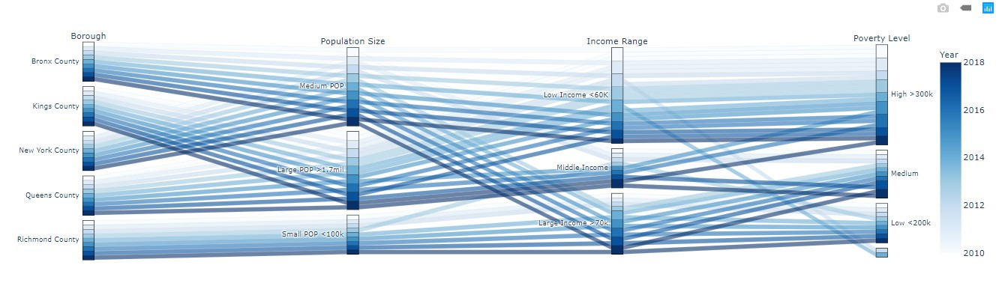
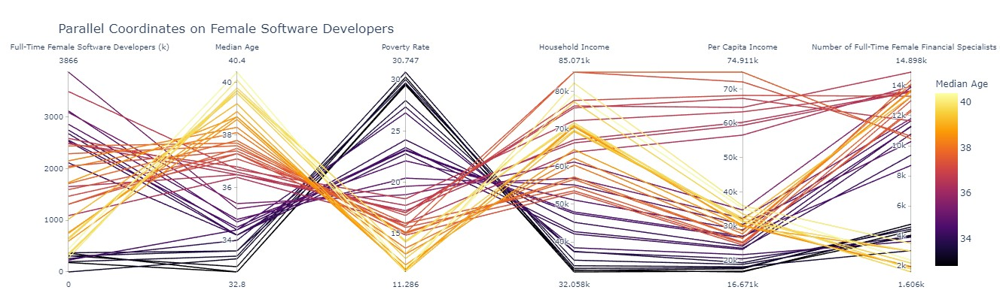
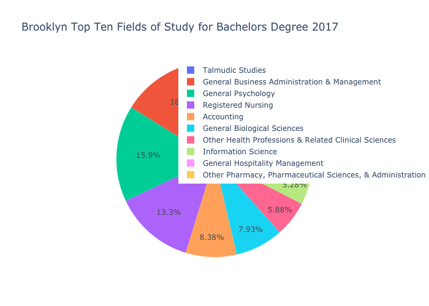
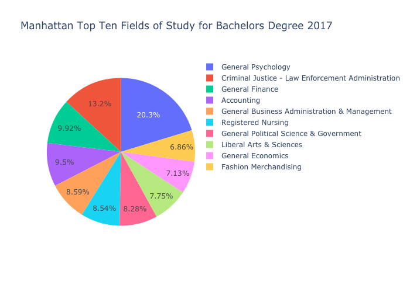
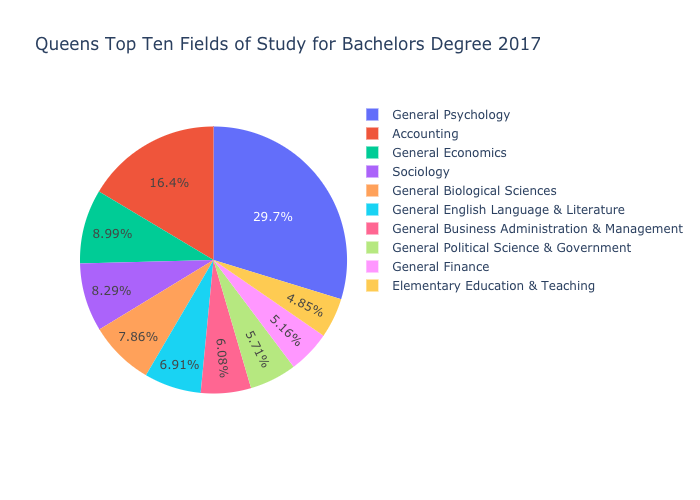
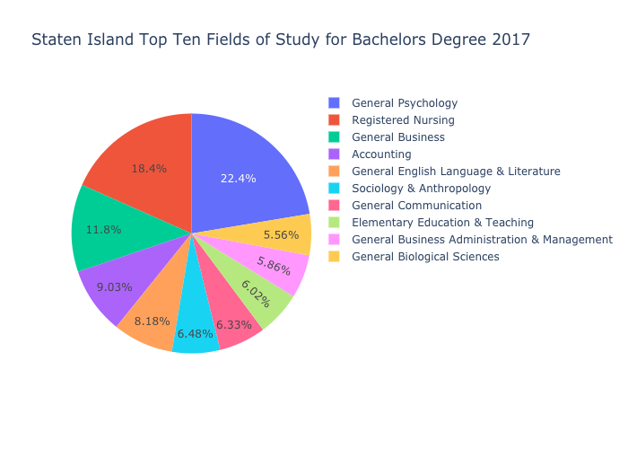
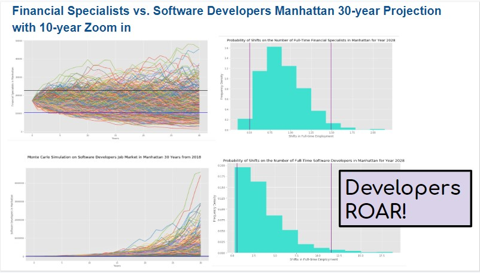

# mandalorians

## Overview
Generation Z, are you ready for your first job?

Our goal is to develop a tool to assess the future viability/trends of different job types in New York by Borough, which will help fresh graduates assess potential career direction or existing employees understand industry trends by the job. It also will highlight which are the most attractive Boroughs for the job types.

Regardless of our ages, understanding of current job market is crutial to achieve peace of mind. The mandalorians are here to help you. A visual job market panel dashboard will incorporate job trends across five boroughs of NYC. Analysis and predictions will be available based on historical demographic records. For the purpose of our bootcamp, focus will be put on fintech, i.e. finance and technology. 


## Data 
### Data Hunting
In the project, we used the following API data banks:
* [Data USA](https://datausa.io/about/api/)
* [Open Data Socrata NYC](https://www.opendatanetwork.com/entity/0500000US36047/Kings_County_NY/jobs.occupations.employed?occupation=Business%20and%20Finance&year=2018)
* [US Census](https://www.census.gov/data/developers/guidance/api-user-guide.Available_Data.html)

Other data sources are used as references. Certain information overlap with the above APIs:
* [Bureau of Labor NY State](https://www.labor.ny.gov/stats/nyc/index.shtm)
* [NYC Job Stats](https://data.cityofnewyork.us/City-Government/NYC-Jobs/kpav-sd4t)

### Data Retrieving and Cleaning
US Census data American Community Survey one-year estimates are used for the interactive map and future trajectories. Data are extracted from 2010 to 2018.

_**To retrieve data from Census API, need to request online. The key will be emailed to the address provided on the next business day.**_ 

Step 1 - On python, the following code is used:
``` 
# Dependencies
import numpy as np
import pandas as pd
import matplotlib.pyplot as plt
import requests
from census import Census
import gmaps
import os
from us import states
from pathlib import Path
%matplotlib inline

from datetime import datetime, timedelta
from matplotlib import style
import seaborn as sns

style.use('ggplot')
```
For Census API
```
# Census & gmaps API Keys
api_key = os.getenv("CENSUS_API_KEY")
mapbox_key = os.getenv("MAPBOX_API_KEY")
c_2018 = Census(api_key, year=2018)
c_2017 = Census(api_key, year=2017)
c_2016 = Census(api_key, year=2016)
c_2015 = Census(api_key, year=2015)
c_2014 = Census(api_key, year=2014)
c_2013 = Census(api_key, year=2013)
c_2012 = Census(api_key, year=2012)
c_2011 = Census(api_key, year=2011)
c_2010 = Census(api_key, year=2010)
c_2009 = Census(api_key, year=2009)
c_2008 = Census(api_key, year=2008)
c_2007 = Census(api_key, year=2007)
c_2006 = Census(api_key, year=2006)
c_2005 = Census(api_key, year=2005)
c_2004 = Census(api_key, year=2004)
```
Step 2 - Use
`c_2018.acs1.get` to fetch ACS1 data for year 2018. For year 2017, use `c_2017.acs1.get`. Same rules apply to other years to as early as 2010.

Step 3 - Select a list of "variables": "column names" as follows:
```
"B01003_001E": "Population",
"B01002_001E": "Median Age",
"B19013_001E": "Household Income",
"B19301_001E": "Per Capita Income",
"B17001_002E": "Poverty Count",
"B23025_005E": "Unemployment Count",
                                      
"B24020_001E": "Employed_age16+_civilian",
"B24020_002E": "Employed_male",
"B24020_008E": "Financial_managers_male",
"B24020_015E": "Male_business_operations",
"B24020_016E": "Financial_specialists_male",
"B24020_017E": "Accountants_&_auditors_male",
"B24020_021E": "Computer_male",
"B24020_022E": "Male_data_scientits",
"B24020_023E": "Software_devops_male",
"B24020_024E": "Database_&_system_male",
    
"B24020_153E": "Employed_female",
"B24020_159E": "Financial_managers_female",
"B24020_163E": "Female_business_operations",
"B24020_167E": "Financial_specialists_female",
"B24020_168E": "Accountants_&_auditors_female",
"B24020_172E": "Computer_female",
"B24020_173E" : "Female_data_scientits",
"B24020_174E": "Software_devops_female",
"B24020_175E": "Database_&_system_female",
    
"B24041_012E": "Information_age16+_total",
"B24041_014E": "Finance_and_insurance",
"B24041_015E": "Real_estate"
```

Step 4 - Calculate poverty and unemployment rates
``` 
# Add in Poverty Rate (Poverty Count / Population)
census_occupation_gender_pd_2018["Poverty Rate"] = 100 * \
    census_occupation_gender_pd_2018["Poverty Count"].astype(
        int) / census_occupation_gender_pd_2018["Population"].astype(int)

# Add in Employment Rate (Employment Count / Population)
census_occupation_gender_pd_2018["Unemployment Rate"] = 100 * \
    census_occupation_gender_pd_2018["Unemployment Count"].astype(
        int) / census_occupation_gender_pd_2018["Population"].astype(int)
```

Step 5 - Concatenate data
* Inner join by rows and then reset index, which provides 28 columns with 27 variables
* Outer join by rows and reset index, leaving 37 columns with 26 variables
* Used data from inner join which is 9 variables less than those we fetched as not all data is available for all years. They are: Unemployment rate, Business Operators for both genders and Data Scientists for both genders. For business operators and deta scientists, it is due to a change in the variable code on census for year 2017. 

Step 6 - Data cleaning
The data cleaning process involves filling NaN values with 0 by `fillna(0)`.  When calculating percent changes in full-time employments. In addition, for year 2013, there is a 0 for the number of female software developers in Bronx. After taking the percent changes, the value is `inf`for 2014. It is replaced by NaN by: 

```
replace([np.inf, -np.inf], np.nan, inplace=True)
```


_**Please see further details on data fetching and cleaning processes by clicking on the links below:**_

[To retrieve API from Census](scatter_plots/Code/data_retrieving_02182020.ipynb)

[Data concatening](monte_carlo/Coding/census_data_2010_2018.ipynb
)

### Python Libraries
* **census** 
    * Step 1: Install on Bash: 
        * ```pip install census```
    * Step 2: import on Python
        * ```from census import Census```

* **us**
   * Step 1: Install on Bash: 
        * ```pip install us```
    * Step 2: import on Python
        * ```from us import states```
     
* **sodapy**


### Analysis

#### Geographic Map


#### Relation with Demographic Factors




##### Education Degree






##### Inter-dependencies


#### Future Trends
For trajectories of future job trends, we used monte-carlo simulation in python. 





### **Additional Project Documents**

_**[Link to Presentation](https://docs.google.com/presentation/d/1rtaCijE2yw2pHfMtWJ3grtdd7VvbSp66cjh0u_HyziI/edit#slide=id.g7e18055ba8_0_130)**_

_**[Link to Initial Project Map with Comments](https://docs.google.com/document/d/17C6jfAqa9hg0D2RsK9iC1Sl6SkorbZ8mPUVh8Tb8GPs/edit)**_

# References

* https://www.google.com/search?q=hvplot+line+plot&rlz=1C1CHBF_enUS867US867&oq=hvplot+line+plot&aqs=chrome..69i57j69i60.5738j0j4&sourceid=chrome&ie=UTF-8
* https://hvplot.holoviz.org/user_guide/Plotting.html
* https://stackoverflow.com/questions/59118664/lineplot-with-markers-in-holoviews-or-hvplot
* http://holoviews.org/user_guide/Customizing_Plots.html
* https://machinelearningmastery.com/how-to-use-statistics-to-identify-outliers-in-data/
* https://docs.python.org/3.3/library/random.html#random.sample
* https://stackoverflow.com/questions/14088687/how-to-change-plot-background-color/23907866
* https://datausa.io/about/api/
* https://www.opendatanetwork.com/entity/0500000US36047/Kings_County_NY/jobs.occupations.employed?occupation=Business%20and%20Finance&year=2018
* https://www.census.gov/data/developers/guidance/api-user-guide.Available_Data.html