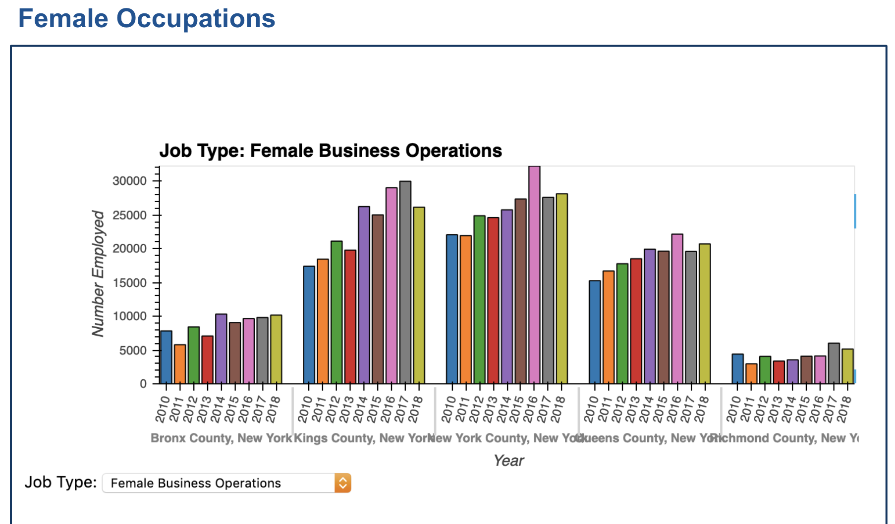

# mandalorians

## Overview
Generation Z, are you ready for your first job?

Our goal is to develop a tool to assess the future viability/trends of different job types in New York by Borough, which will help fresh graduates assess potential career direction or existing employees understand industry trends by the job. It also will highlight which are the most attractive Boroughs for the job types.

Regardless of our ages, understanding of current job market is crutial to achieve peace of mind. The mandalorians are here to help you. A visual job market panel dashboard will incorporate job trends across five boroughs of NYC. Analysis and predictions will be available based on historical demographic records. For the purpose of our bootcamp, focus will be put on fintech, i.e. finance and technology. 


## Data 
### Data Hunting
In the project, we used the following API data banks:
* [Data USA](https://datausa.io/about/api/)
* [Open Data Socrata NYC](https://www.opendatanetwork.com/entity/0500000US36047/Kings_County_NY/jobs.occupations.employed?occupation=Business%20and%20Finance&year=2018)
* [US Census](https://www.census.gov/data/developers/guidance/api-user-guide.Available_Data.html)

Other data sources are used as references. Certain information overlap with the above APIs:
* [Bureau of Labor NY State](https://www.labor.ny.gov/stats/nyc/index.shtm)
* [NYC Job Stats](https://data.cityofnewyork.us/City-Government/NYC-Jobs/kpav-sd4t)

### Data Retrieving and Cleaning
US Census data American Community Survey one-year estimates are used for the interactive map and future trajectories. Data are extracted from 2010 to 2018.

_**To retrieve data from Census API, need to request online. The key will be emailed to the address provided on the next business day.**_ 

<details><summary>
Step 1 - On python, the following code is used:</summary>

``` 
# Dependencies
import numpy as np
import pandas as pd
import matplotlib.pyplot as plt
import requests
from census import Census
import gmaps
import os
from us import states
from pathlib import Path
%matplotlib inline

from datetime import datetime, timedelta
from matplotlib import style
import seaborn as sns

style.use('ggplot')
```
</details>

<details><summary>
Step 2 - Fetching Census API</summary>
```
# Census & gmaps API Keys
api_key = os.getenv("CENSUS_API_KEY")
mapbox_key = os.getenv("MAPBOX_API_KEY")
c_2018 = Census(api_key, year=2018)
c_2017 = Census(api_key, year=2017)
c_2016 = Census(api_key, year=2016)
c_2015 = Census(api_key, year=2015)
c_2014 = Census(api_key, year=2014)
c_2013 = Census(api_key, year=2013)
c_2012 = Census(api_key, year=2012)
c_2011 = Census(api_key, year=2011)
c_2010 = Census(api_key, year=2010)
c_2009 = Census(api_key, year=2009)
c_2008 = Census(api_key, year=2008)
c_2007 = Census(api_key, year=2007)
c_2006 = Census(api_key, year=2006)
c_2005 = Census(api_key, year=2005)
c_2004 = Census(api_key, year=2004)
```
</details> 

<details><summary>
Step 3 - Use `c_2018.acs1.get`
 to fetch ACS1 data for year 2018. </summary> 
For year 2017, use `c_2017.acs1.get`. Same rules apply to other years to as early as 2010.
</details>

<details><summary>
Step 4 - Select a list of "variables": "column names" as follows:</summary>
```
"B01003_001E": "Population",
"B01002_001E": "Median Age",
"B19013_001E": "Household Income",
"B19301_001E": "Per Capita Income",
"B17001_002E": "Poverty Count",
"B23025_005E": "Unemployment Count",                                  
"B24020_001E": "Employed_age16+_civilian",
"B24020_002E": "Employed_male",
"B24020_008E": "Financial_managers_male",
"B24020_015E": "Male_business_operations",
"B24020_016E": "Financial_specialists_male",
"B24020_017E": "Accountants_&_auditors_male",
"B24020_021E": "Computer_male",
"B24020_022E": "Male_data_scientits",
"B24020_023E": "Software_devops_male",
"B24020_024E": "Database_&_system_male", 
"B24020_153E": "Employed_female",
"B24020_159E": "Financial_managers_female",
"B24020_163E": "Female_business_operations",
"B24020_167E": "Financial_specialists_female",
"B24020_168E": "Accountants_&_auditors_female",
"B24020_172E": "Computer_female",
"B24020_173E" : "Female_data_scientits",
"B24020_174E": "Software_devops_female",
"B24020_175E": "Database_&_system_female",   
"B24041_012E": "Information_age16+_total",
"B24041_014E": "Finance_and_insurance",
"B24041_015E": "Real_estate"
```
</details>

<details><summary>
Step 5 - Calculate poverty and unemployment rates </summary>
``` 
# Add in Poverty Rate (Poverty Count / Population)
census_occupation_gender_pd_2018["Poverty Rate"] = 100 * \
    census_occupation_gender_pd_2018["Poverty Count"].astype(
        int) / census_occupation_gender_pd_2018["Population"].astype(int)
# Add in Employment Rate (Employment Count / Population)
census_occupation_gender_pd_2018["Unemployment Rate"] = 100 * \
    census_occupation_gender_pd_2018["Unemployment Count"].astype(
        int) / census_occupation_gender_pd_2018["Population"].astype(int)
```
</details>

<details><summary>
Step 6 - Concatenate data </summary>
* Inner join by rows and then reset index, which provides 28 columns with 27 variables
* Outer join by rows and reset index, leaving 37 columns with 26 variables
* Used data from inner join which is 9 variables less than those we fetched as not all data is available for all years. They are: Unemployment rate, Business Operators for both genders and Data Scientists for both genders. For business operators and deta scientists, it is due to a change in the variable code on census for year 2017. 
</details>

<details><summary>
Step 7 - Data cleaning </summary>
The data cleaning process involves filling NaN values with 0 by `fillna(0)`.  When calculating percent changes in full-time employments. In addition, for year 2013, there is a 0 for the number of female software developers in Bronx. After taking the percent changes, the value is `inf`for 2014. It is replaced by NaN by: 

```
replace([np.inf, -np.inf], np.nan, inplace=True)
```


</details>

_**Please see further details on data fetching and cleaning processes by clicking on the links below:**_

**[To retrieve API from Census](scatter_plots/Code/data_retrieving_02182020.ipynb)**

**[Data concatening](monte_carlo/Coding/census_data_2010_2018.ipynb
)**

### Python Libraries
* **census** 
    * census is designed to access US Census API with ACS estimates 5-year, 3-year, 1-year and summary files respectively. Data fetching process are explained officially at [Python Website](https://pypi.org/project/CensusData/) and examples are available at [Github](https://github.com/datamade/census)
    * Step 1: Install on Bash: 
        * ```pip install census```
    * Step 2: import on Python
        * ```from census import Census```

* **us**
   * Step 1: Install on Bash: 
        * ```pip install us```
    * Step 2: import on Python
        * ```from us import states```
     
* **sodapy**
    * A python package to access Open Data Socrata API on demographic and economic data.
    * Official documents are posted on [Python](https://pypi.org/project/sodapy/)
    * Examples are available on [Github](https://github.com/socrata/socrata-py)

## Launching the Dashboard
* The main application is located in the **dashboard** folder. To run the application, open a command prompt, change to the directory containing **dashboard.py** and run **bokeh serve --show dashboard.py**. This runs a bokeh server locally and will automatically open the interactive dashboard in your browser at localhost:5006.

### Analysis

#### Geographic Map


#### Relation with Demographic Factors

We see that, with increase in median age, household income increases while per capita income decreases. Interestingly, a higher poverty rate raise the number of full-time software developers for both males and females to similar extents, as shown by the darker colored lines in the parallel coordinates plots, associated with younger ages. On the other hand, however, it is more likely to positively impact the number of full-time female financial specialists more than their male counter-parties. 

Comparing the employment figures, the number of male software developers triples the number of female developers. In financial specialists fields, full-time male employees only doubles the number of females in New York City. 


##### Education Degree

Concentration of degree programs tells how competitive it is for a fresh graduate in certain degree to land on a job in a certain borough. It is related to competitive index. As a start up, it may be a wise choice to avoid competition face-to-face. As Ben and Jerry started to sell their first scoop of ice cream in cold Vermont, there is definitely something to think about related to the scenario. 

For example, 


<details> <summary>
Pie Charts to Show Bachelors Degree Concentrations in Brooklyn, Manhattan, Queens and Staten Island </summary>
 


</details>


#### Inter-dependencies Revealed on Job Searching Tool





#### Future Trends based on Monte-carlo Simulations

_**Methodology**_

For trajectories of future job trends, we used monte-carlo simulation in python. Data for estimating the mean and standard deviation of cumulative changes in full-time employment are based on Census ACS one-year estimates API over the nine years from 2010 to 2018. The latest accessible data on Census is based on 2018. Thereafter, it serves as the inital value of the monte-carlo simulations. Given the high speed of development in technology field, especially related to AI and machine learning, we zoomed in from the original 30-year to 10-year trajectories for full-time software developers. 

For overall borough estimates, a 50-50 weight is used for male-to-female ratio. The overall employment and the median in the trajectory graphs are estimated in the same fashion in order to obtain a view of relative level of employment by gender. Thus, an estimate of the total employment would be doubling the initial value as shown on the graph. 1000 Simulations were carried out for male, female and evenly-blended groups for each of the five NYC boroughs on financial specialists and software developers categories. 

The assumption is that the average rate of change with its volatities stays the same as the past nine years. However, it is likely that the current speed would be slowed down as part of the cycle. An example of such would be the internet "bubble" in 1990s. Even though some of the predicted features could not be realized short-term, they serve as foundations for research and development in the future. On the other hand, candidates would like to view paths in upcoming years on potential vacancies in jobs. The changes in full-time job openings are built upon previous conditions. In addition, not enough other information is available on exactly how different economic indicators impact paticular job fields, such as on technology. Therefore, Monte-carlo Analysis serves as a viable tool for our job hunting analyzer.

_**Five types of graphs are used to analyse the trends:**_ 

* Trajectories on cumulative products for changes in full-time employment by borough
 * Example 

    * _**Interpretation**:_
        * The starting point at 1.0 suggests a 100% cumulative product in 2018 as the initial composition of the percent changes in full-time employment in Financial Specialists. 
        * By the end of 10 years, i.e. in 2028, the employment number is expected to be ranging from as low as 50% to as high as 180% of what it was in 2018.
        * By the end of 30 years, i.e. in 2028, the number of full-time financial specialists would range from a quarter to 2.7 times  of those in 2018.
        * Trajectory paths that are trending downward appear denser as years stretches further into the future. Hence, it is more likely that the number of full-time financial specialists would decrease as we move into the next three decades. 

* Trajectories on the number of full-time employment by borough
    * Example

    * Blue lines represents initial employment of females
    * Black lines represents initial male employment
    * _**Interpretation**:_ 
        * there were more female than male full-time employed as financial specialists in Queens in 2018. In a decade, the number of employment may become as low as 12,000k, i.e. doubling the about of 6,000k as shown by the lowest trajectory line at year 10, to as high as 3,200k as indicated by the yellow line on the top. 
        * Since the yellow curve would likely to fall out of 95% confidence interval, it could be an outlier and not producing trustworthy estimates. 
        * The employment figure would rather top at 4,400k, as suggested by the green line.

* 90% confidence interval chart of the simulations

    * _**Interpretation**:_
        * In Brooklyn, there is a 95% chance that an initial employment of 13,841k for male software developers will end up within in the range of 20,895k and 111,925k by the end of 2048.
        * There is a 95% chance for an initial employment of 13,841k male software developers in Brooklyn to grow to the range of 13,481k and 35,575k over the next 10 years .

* Frequency density histograms showing 95% confidence intervals on cumulative moves

    * The median employment trajectories are included with upper and lower bounds
    * _**Interpretation**:_
        * In Manhattan, there is a 72.5% chance that the number of full-time software developers would become 50 times as much as those in 2018, given by the area of the first rectangular bar, i.e. 0.0145*50 = .725.
        * It is 95% likely that the number of full-time software developers would fall in the range of zero to 170 times as much as it was in 2018, as suggested by the two fences in the graph

* Frequency histograms

    * _**Interpretation**:_
        * By the end of 2048, it is 70% likely that the number of full-time financial specialist would be within the range of 0 to what it was in 2018, as suggested by the first rectangular bar for results from 700 out of 1000 simulations. 
        * There is a 20% possibility of full-time financial specialists staying the same to double the number of 2018 based on the height and width of the second bar.

_**Conclusions: Which galaxy shall we land?**_

By comparing 30-year trajectories and probability histograms on 2028 estimates, as a software developer, top choices are Manhattan, Brooklyn and Bronx. If you are determined to work as a financial specialist, Staten Island and Brooklyn should be your priorities for potentially expanding job market. 

While Manhattan hosts the absolute number of both financial specialists and software developers, the number of software developers is expected to increase drastically while the market for full-time financial specialists shows a contracting trend. In a decade, there is a 95% chance that the range of software developers would fall between a quarter to 11.5 times as it was in 2018. On the other hand, the number of financial specialists 

In Brooklyn, both the job markets for both financial analysts and software developers are expanding, potentially up to 2.5 and 3 times of employment in 2018 respectively in a decade. 

**Trajectories and probability histograms for Manhattan, Bronx, Brooklyn, Queens and Staten Island**


<details><summary> Graphs for other boroughs </summary>


</details>

_**To reach further, we are standing on the shoulder of current data**_

From _**Tables of Statistics**_ below, we see some interesting facts:
* Except Manhattan that has twice as many full-time male financial specialists as their female peers, all other boroughs employed more female financial specialists than males as of 2018. 
* All boroughts employed one and a half to three times as many full-time financial specialists as software developers by the end of 2018. 
* It implies that the job market for software engineers are far from reaching saturation.

<details><summary> 
Tables of Statistics
</summary>


</details>

_**Dream of becoming a banker? Great opportunities emerge from rough times and Wah-lah, distant neighborhoods.**_

Upward trends in financial specialists appear in Brooklyn and Staten Island. Where would you pick to live and playing with numbers?

<details><summary>
Financial Specialist Job Market Borough Comparison 
</summary>


</details>

_**Software developers are hot!**_

There is an upward trend for the expected openings for software developers positions in all boroughs of NYC. However, it is possible for Bronx and Staten Island to keep a steady number of employment in this area. 

<details><summary>
Software Developers Job Market Borough Comparison 
</summary>


</details>

_**Software Developers by Gender**_

Software developers market is sizzling for male developers in all five boroughs of NYC except Bronx, which shows a more stationary market. Manhattan and Brooklyn exhibits the most potential for growth. If a female graduate in computer science were to use our tool, the implications are numerous. The aforementioned student can parse that her field is likely to see growth and if she wanted the more superior job market she would focus her job search in Brooklyn because based on our monte carlo simulation, the number of expected female software developers will grow more than the male counterpart in the next 10 years. Our tool would mean deep insight to a fresh graduate eager to explore employment opportunities. 
<details><summary>
Graphs for gender comparison on software developers
</summary>


</details>

_**Financial Specialists by Gender**_

Gentlemen in finance industry would pick Manhattan, Brooklyn and Staten Island. While Brooklyn and Staten Island are also good habitat for ladies that are looking for financial specialists positions, it's suggested that Queens would be more preferrable than Manhattan in the next 30 years. 

<details><summary>
Graphs for gender comparison on Financial Specialists
</summary>


</details>


### Discussions
Since the latest available data is from 2018, research needs to be done on recent couple of years regarding alterations in job trends. 

### **Additional Project Documents**

_**[Link to Presentation](https://docs.google.com/presentation/d/1rtaCijE2yw2pHfMtWJ3grtdd7VvbSp66cjh0u_HyziI/edit#slide=id.g7e18055ba8_0_130)**_

_**[Link to Initial Project Map with Comments](https://docs.google.com/document/d/17C6jfAqa9hg0D2RsK9iC1Sl6SkorbZ8mPUVh8Tb8GPs/edit)**_

# References

* https://www.google.com/search?q=hvplot+line+plot&rlz=1C1CHBF_enUS867US867&oq=hvplot+line+plot&aqs=chrome..69i57j69i60.5738j0j4&sourceid=chrome&ie=UTF-8
* https://hvplot.holoviz.org/user_guide/Plotting.html
* https://stackoverflow.com/questions/59118664/lineplot-with-markers-in-holoviews-or-hvplot
* http://holoviews.org/user_guide/Customizing_Plots.html
* https://machinelearningmastery.com/how-to-use-statistics-to-identify-outliers-in-data/
* https://docs.python.org/3.3/library/random.html#random.sample
* https://stackoverflow.com/questions/14088687/how-to-change-plot-background-color/23907866
* https://datausa.io/about/api/
* https://www.opendatanetwork.com/entity/0500000US36047/Kings_County_NY/jobs.occupations.employed?occupation=Business%20and%20Finance&year=2018
* https://www.census.gov/data/developers/guidance/api-user-guide.Available_Data.html
* https://api.census.gov/data/key_signup.html
* https://github.com/datamade/census
* https://github.com/socrata/socrata-py
* https://pypi.org/project/CensusData/